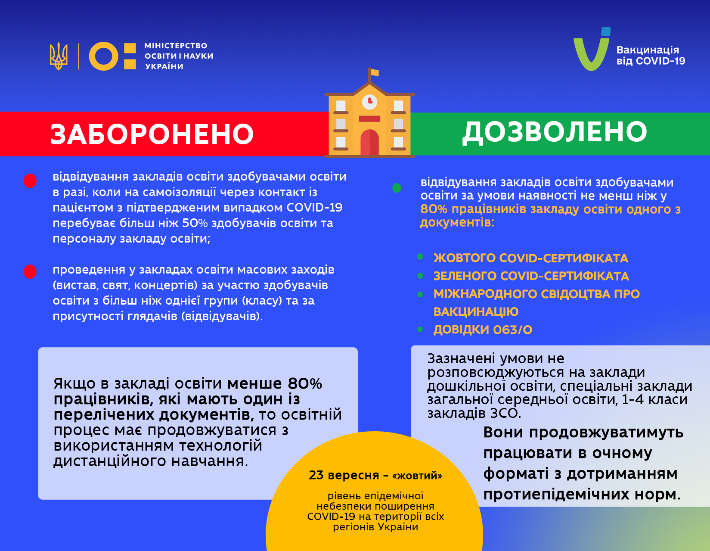

Із 23 вересня Україна переходить у «жовтий» рівень епідемічної небезпеки поширення COVID-19. У зв'язку з цим Уряд оновив карантинні умови, зокрема щодо роботи закладів освіти. Про це [повідомив](https://t.me/SerhiyShkarlet/321) Міністр освіти і науки України Сергій Шкарлет.

«При "жовтому" рівні відвідування закладів освіти здобувачами освіти буде дозволено за умови наявності не менш ніж у 80% працівників закладу освіти одного з обов’язкових документів. Їх перелік опублікований [тут](https://mon.gov.ua/ua/news/iz-23-veresnya-v-ukrayini-bude-vstanovleno-zhovtij-riven-epidnebezpeki-u-mon-rozpochato-naradu-z-kerivnikami-oblasnih-departamentiv-osviti). Якщо в закладі освіти менш ніж 80% працівників, які мають один із необхідних документів, навчання має продовжуватися (!) з використанням технологій дистанційного навчання. Підкреслюю, освітній процес триватиме в дистанційному форматі», – наголосив Міністр.

Відповідно до [постанови](https://zakon.rada.gov.ua/laws/show/1236-2020-%D0%BF#Text) Уряду №1236 від 9 грудня 2020 року (зі змінами)  при «жовтому» рівні епідемічної небезпеки забороняється:

- відвідування закладів освіти здобувачами освіти в разі, коли на самоізоляції через контакт із пацієнтом з підтвердженим випадком COVID-19 перебуває більш ніж 50% здобувачів освіти та персоналу закладу освіти;
- проведення в закладах освіти масових заходів (вистав, свят, концертів) за участю здобувачів освіти з більш ніж однієї групи (класу) та за присутності глядачів (відвідувачів).

Сергій Шкарлет також розповів про роботу дитячих садочків, початкових класів і спеціальних шкіл.

«Неодноразово наголошував на тому, що вихованці дитсадків, учні початкової школи та спеціальних закладів освіти потребують безпосереднього контакту з педагогічними працівниками. Тривала “дистанційка” для наймолодших може призвести до непоновлюваних втрат у навчанні. Тому за моєю ініціативою та за підтримки Уряду сьогодні були внесені відповідні зміни до постанови КМУ», – повідомив Міністр.

Зокрема, йдеться про такі зміни:

- умова щодо наявності 80% вакцинованого персоналу НЕ поширюватиметься на заклади дошкільної освіти, спеціальні заклади загальної середньої освіти, 1-4 класи закладів ЗСО. Вони продовжуватимуть працювати в очному форматі з дотриманням протиепідемічних норм; 
- такий «виняток» діятиме при «жовтому» та «червоному» рівнях епіднебезпеки.

«Водночас укотре звертаюся  до голів ОДА, директорів обласних департаментів освіти, керівників усіх закладів освіти та кожного освітянина окремо. Прошу свідомо поставитися до необхідності вакцинації, адже сьогодні COVID-19 стає “пандемією невакцинованих”», – підкреслив Сергій Шкарлет.

Міністр звернув увагу на те, що запроваджені Урядом обмежувальні заходи – це кроки до стримування темпів поширення вірусу, до мінімізації ризиків захворюваності серед населення, до збереження економічної стабільності в державі. «Але без нас із вами ці кроки не спрацюють. На сьогодні Україна повністю забезпечена вакциною, організована зручна та доступна інфраструктура роботи пунктів щеплення. А тому залишилося лише кожному з нас зробити свій вибір на користь здоров’я та безпеки оточення», – наголосив Сергій Шкарлет.

