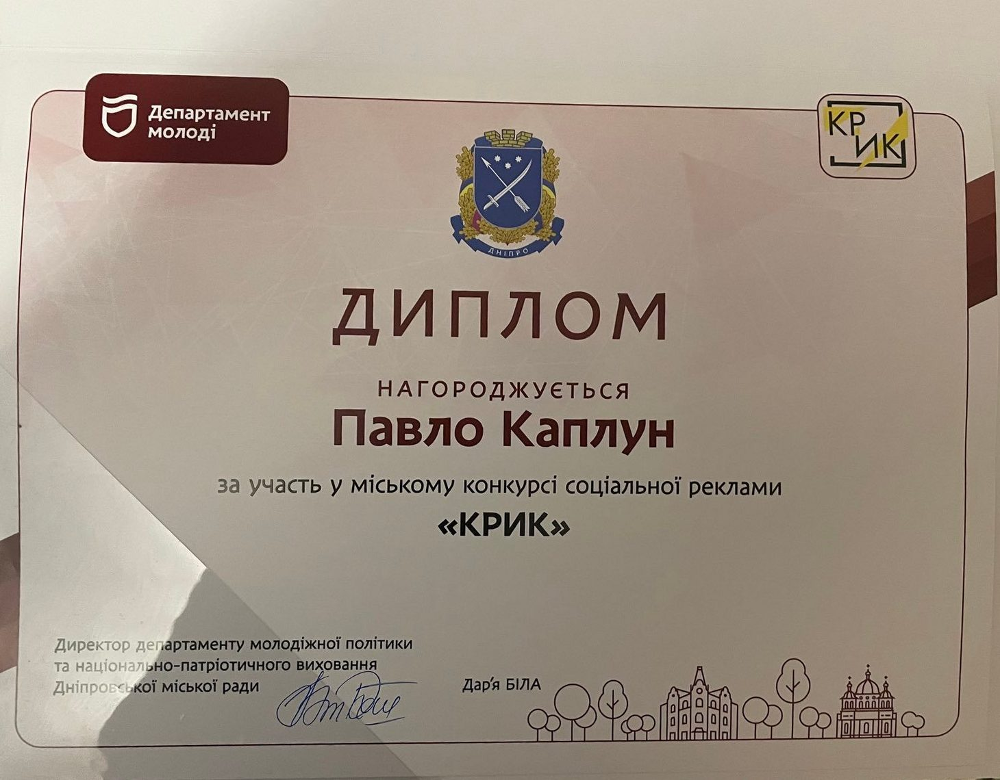

---
title: Перемога на міському конкурсі соціальної реклами «Крик»
---

Уже другий рік поспіль Павло Каплун, учень 11-А класу КЗШ №55 КМР ДО, із дружною творчою командою активно знімає ігрове кіно. Кожна стрічка висвітлює чергову проблему сучасних підлітків, реалізовану через цікавий і зрозумілий кожному сценарій, підкреслену якісною режисерською та операторською роботою.

Вітаємо Павла та його команду з перемогою на міському конкурсі соціальної реклами «Крик» і бажаємо нових звершень у творчій діяльності!

